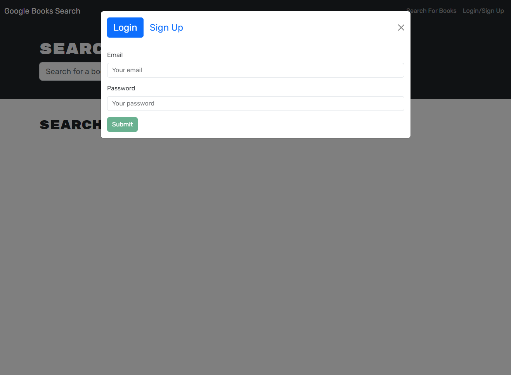
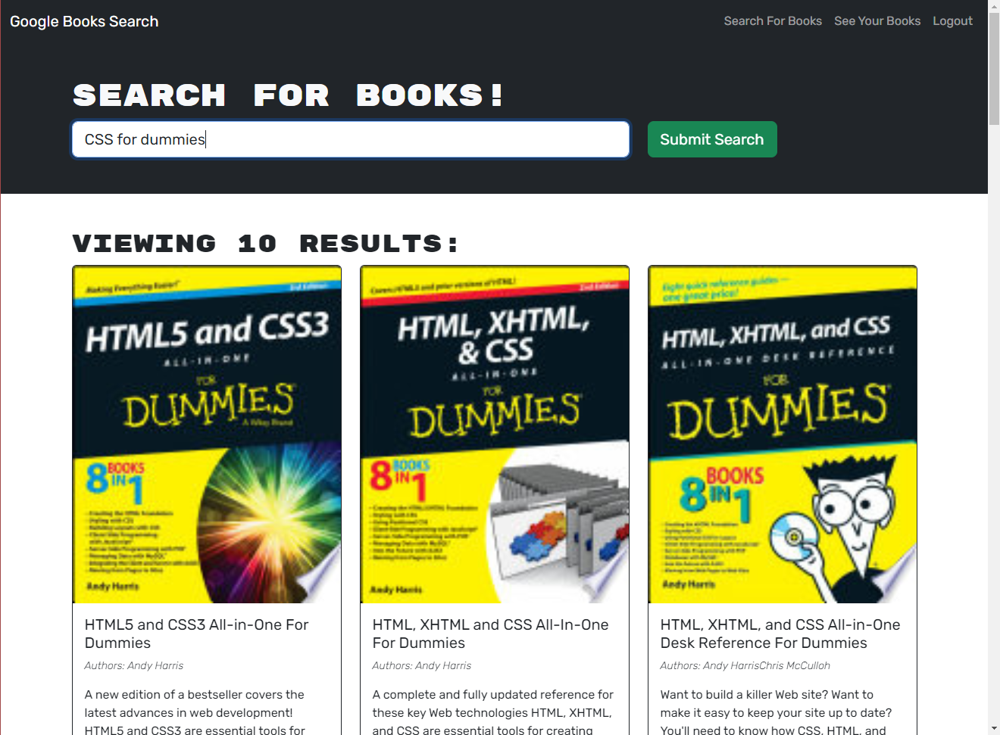
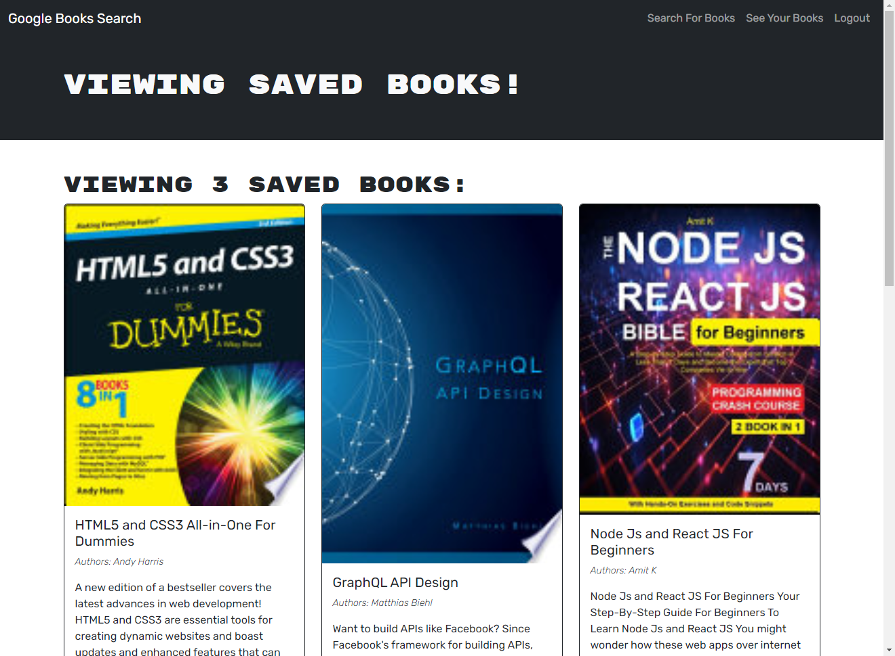

# Book Search Rebuild

## Description

This application was given as a fully functioning Google Books API search engine built with a RESTful APIa. This app has been rebuilt to be a GraphQL API built with Apollo Server. 

This app allows you to sign up, search for books, and then add those books to your account so you can view them later.
Use it as a list of favorite books or a book wishlist. 

Give it a try [HERE](https://book-search-rebuild.onrender.com/)

## Take a Look

**LOGIN MODAL**

**SEARCH PAGE**

**SAVED BOOKS**

## Contact Me
Check out my [Git-Hub](https://github.com/EnchantedMoth) or send me an email at timothy.james.lewis.31@gmail.com